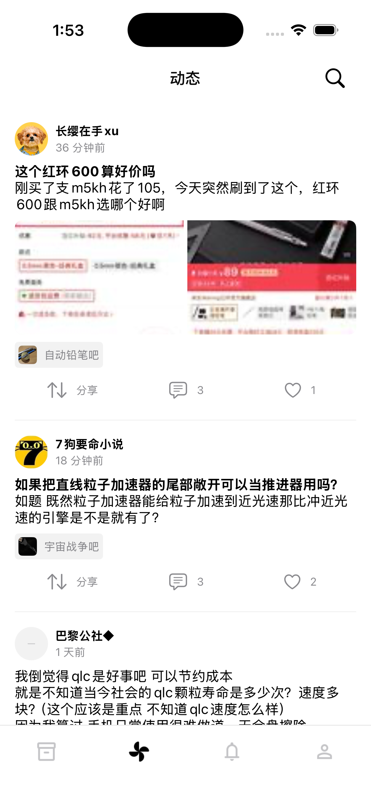
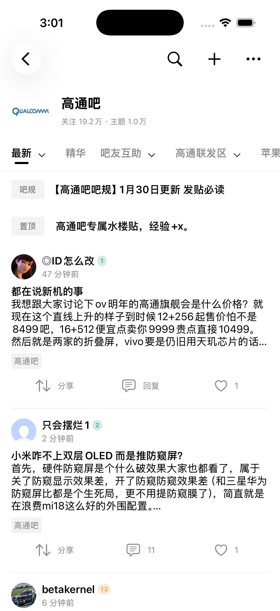
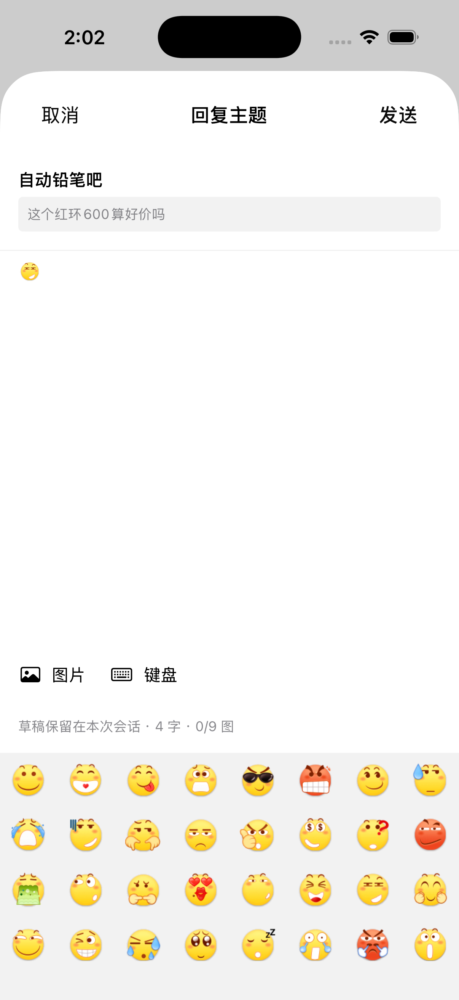
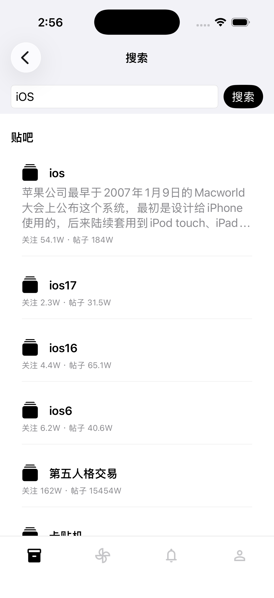

# TiebaLite iOS

TiebaLite iOS 是一个非官方的 iOS/iPadOS 贴吧客户端，提供阅读、消息与发帖/回复编辑功能。v0.2.0beta3 新增最近逛吧长按删除，修复进吧底部短暂遮挡、刷新提示栏和 iPad 旋转后的阅读位置，并优化滚动时刷新、缓存命中和长列表重复计算。更新与安装方式见 [版本说明](Docs/Releases/v0.2.0beta3.md)。排序记忆、阅读缓存、图片保存分享等见 [Beta 2 版本说明](Docs/Releases/v0.2.0beta2.md)，当前定向验证与已知限制见 [任务记录](Docs/Progress/TASK_STATE.md)。

## 已实现

- 用户可见的 WKWebView 登录、Keychain 会话保存和冷启动恢复；
- 最近浏览/关注的吧、动态推荐流、吧首页排序/分类及连续分页；
- 帖子楼层、前三条子回复预览、独立完整楼中楼及分页；
- 真实用户/吧头像、接口提供的等级、紧凑图片网格和官方表情内联；
- 排序记忆、吧首页与帖子缓存、阅读位置恢复、最多两个投机内容预载；
- 图片磁盘缓存与同资源请求共享、唯一 MediaViewer、左右切图、缩放与自由平移、按需加载原图、长按保存原图或分享文件；
- 回复我的/提到我的、未读计数；引用打开主题，具体回复定位帖子中的一级楼层（楼中楼消息定位父楼）；
- 新帖、主题回复、楼层回复和楼中楼回复编辑器，会话草稿、图片选择/上传与表情选择；
- 贴吧/帖子搜索、本地历史、账户资料、外观与阅读字号设置；
- 正文、楼中楼与动态摘要链接；站内帖子/吧链接走原生页面，外部网页走系统浏览器；明确用户 ID 的 @提及进入资料；
- 帖子顶部吧入口、动态吧标签、帖子/动态系统分享和复制公开链接，更多菜单复用已有重新加载操作；
- iPhone/iPad 自适应、深色、大字体与 Reduce Motion，Fixture 驱动的离线自动化。

**发布后的服务端审核结果仍需观察。** 本版补齐发帖/回复请求中遗漏的真实账号显示名，用户已确认修复后的一次文字加表情回复成功并可见。此前曾出现“涉嫌异常行为”删除通知；本次成功不等于后续审核始终通过，也尚不能证明显示名遗漏就是删帖原因。新帖、不同回复目标及多图实网发送的覆盖仍不完整。自动化只使用 Mock，不发送真实内容；Live 发送由用户自行决定。

未实现签到、点赞、远端帖子/回复删除、私信、系统推送、收藏和批量离线下载；已有内容缓存与图片保存功能。界面中的已有计数不代表具备对应写操作。项目没有获得百度官方认可，第三方资源及生成 Proto 的 App Store/商业二进制分发权利仍未完成确认。

## 新版截图

以下为 0.2.0 Beta 1 视觉验收时的 iPhone 实际界面，展示公开内容浏览与表情编辑。点击图片可查看原图。

| 动态推荐 | 吧首页 |
| --- | --- |
| <a href="Docs/Screenshots/v0.2.0-beta.1/iphone-feed.png"></a> | <a href="Docs/Screenshots/v0.2.0-beta.1/iphone-forum.png"></a> |
| 表情编辑 | 贴吧搜索 |
| <a href="Docs/Screenshots/v0.2.0-beta.1/iphone-composer.png"></a> | <a href="Docs/Screenshots/v0.2.0-beta.1/iphone-search.png"></a> |

## 系统与工具要求

- macOS 26；
- Xcode 26.6（Swift 6.3.3 工具链，工程使用 Swift 6 language mode）；
- iOS/iPadOS 18.0 或更高；
- XcodeGen 2.45.4、SwiftLint 0.65.0、xcbeautify 3.2.1；
- `protoc` / `protoc-gen-swift` 35.1 / 1.38.1；
- Java 与 Javac 21.0.10（仅用于确定性生成合成 Proto fixture）。

`Config/ToolVersions.env` 是版本真相来源。`Brewfile` 安装 Homebrew 管理的工具，
Java 21.0.10 需由开发者单独安装并确保 `java`、`javac` 位于 `PATH`。

## 从干净 checkout 构建

```bash
git submodule update --init --recursive
cp scripts/project.env.example scripts/project.env
make bootstrap-tools
make doctor
make generate
make build
```

`scripts/project.env` 被 Git 忽略；默认模板不包含秘密，Simulator UDID 留空时会
自动选择可用设备。构建和测试不需要真实账号、Cookie、Keychain 数据或私有响应。
生成的 `TiebaLite.xcodeproj`、DerivedData 与测试结果也不会进入 Git。

要验证 Release：

```bash
make release-build
make release-isolation
```

`project.yml`、`Config/*.xcconfig`、`Config/SwiftPM/Package.resolved` 和测试计划
是工程声明的真相来源，不应手工提交生成的 `.xcodeproj`。

## Live 与 Fixture 边界

Production composition 固定使用 Live Repository、URLSession、Keychain 和
`ProductionImageLoader`，不会静默降级到 Fixture。Debug/UITesting 构建保留
固定 Fixture 与 Mock transport，用于离线演示、确定性测试和接口失效排查；
纯 Fixture Repository、LaunchScenario、Probe、Renderer/Pager/Media Lab 和
1000 条实验入口均从 Release 源与资源中排除。

贴吧接口为私有协议，可能随服务端变化。自动化测试不访问实时贴吧服务器；Live
证据只记录状态码、MIME、响应大小、解码结果、映射数量和 typed error，不保存
完整请求/响应或真实用户内容。

## 登录与隐私边界

- 用户只在可见 WKWebView 中手工输入账号、密码和验证码；App 不读取或保存明文
  密码。
- 运行所需的 BDUSS/STOKEN 仅保存于本 App 的 Keychain；不会写入日志、fixture、
  文档或 Git。
- 浏览历史保存在 App 沙盒内的本地 JSON，设置保存在 UserDefaults。
- 需要授权的 API 仅在有效会话 lease 下发送；图片 CDN 请求使用独立匿名会话，
  不携带登录 Cookie。
- 项目没有第三方分析 SDK；诊断日志只记录脱敏的类型和计数。

## 测试

```bash
make test-unit
make quality-fast
make release-isolation
make quality
```

测试安装通过 Xcode 覆盖现有 App，不卸载、不 erase、不清 Keychain；Fixture 使用隔离的内存会话、历史和设置。

`make quality` 是当前完整 RC 门禁，包含 Debug/Release 构建、Unit、iPhone/iPad
UI smoke、Pager/Media interaction、静态策略、秘密扫描和 Release 隔离。

## Known Limitations

- 这是非官方客户端，贴吧私有 API、字段和错误码可能变化；所有服务端错误码尚未
  覆盖。
- 头像规则遵循已锁定 Android 源码；用户批准仅 `tb.himg.baidu.com/sys/portrait/item/` 使用原版 HTTP（ADR-0024），图片请求不带登录 Cookie。缺失或失败时使用中性占位。
- 本地官方表情目录为 132 张；无法取得原图的表情和服务端仅返回的 `[图片]` 文本不能恢复为图片，未知 token 保留原文。
- iPad 横屏切换“我的”残留旧帖的问题已在 R13 修正，定向回归及用户手工检查通过；完整 Stage Manager 设备矩阵仍未覆盖。
- 动图查看仍只保证可用静态帧；保存/分享保留取得的编码文件和动图数据。无 GIF 动画播放框架、视频或全尺寸图片瓦片；原图查看受4096像素解码预算限制。
- iPad 旋转进入分栏后回首楼已在 U06P4 修复，指定回归和 Live 多页帖检查通过；手工窗口调宽、真机相册与完整设备矩阵尚未验收。
- 真机完整 VoiceOver、iOS 18.x runtime、完整设备/Stage Manager 矩阵尚未验证。
- logout 实现有确定性测试，但为保留当前会话，本轮未执行真实 logout。
- App Store、商标、服务条款、Proto 文件级来源以及商业二进制分发权利尚未完成
  独立确认。

R13 已通过最终用户验收。完整与定向门禁的原始失败、修正及未验证范围保留在验收记录中，不将组合证据描述成一次全绿的 make quality。

## 许可与来源

项目作者有权许可的原创 iOS 源码采用
[GNU General Public License v3.0 only](LICENSE)。该许可不重新许可第三方依赖、
Android reference、生成 Proto 或其他权利归属不明的材料；它们继续适用各自的
许可证和来源边界，详见 [THIRD_PARTY_NOTICES.md](THIRD_PARTY_NOTICES.md) 与
[来源审计](Docs/Audits/SOURCE_AND_LICENSE_NOTES.md)。

此授权自包含该根许可证的版本起适用；`v0.1.0-beta.1` 与
`v0.1.0-beta.2` 是保留其各自历史 `LICENSE` 的旧快照，不追溯改写。
